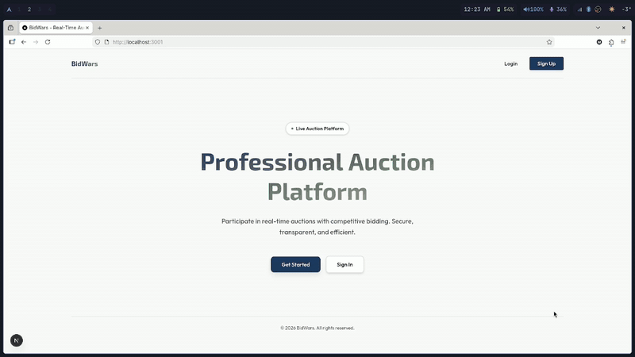

# BidWars - Real-Time Auction Platform

A production-ready, scalable microservices-based auction platform with real-time bidding, built following 2025 best practices for enterprise-grade applications.



## Table of Contents

- [Overview](#overview)
- [Architecture](#architecture)
- [Real-Time System Architecture](#real-time-system-architecture)
- [Event-Driven Architecture with Kafka](#event-driven-architecture-with-kafka)
- [Tech Stack](#tech-stack)
- [Production-Ready Features](#production-ready-features)
- [Prerequisites](#prerequisites)
- [Quick Start](#quick-start)
- [Project Structure](#project-structure)
- [Microservices](#microservices)
- [Best Practices Implemented](#best-practices-implemented)
- [Development](#development)
- [Testing](#testing)
- [Environment Configuration](#environment-configuration)

## Overview

BidWars is a **real-time auction platform** enabling users to participate in live auctions with instant bid updates, comprehensive leaderboards, achievements, and notifications. The platform is designed with a microservices architecture to ensure scalability, maintainability, and fault tolerance.

### Key Features

- **Real-time bidding** via WebSocket connections with JWT authentication
- **Leaderboards** with Redis caching for high-performance queries
- **Achievement system** with unlockable badges and real-time notifications
- **Event-driven architecture** using Apache Kafka for inter-service communication
- **Idempotent operations** ensuring data consistency across services
- **Secure authentication** with NextAuth v5 and server-side JWT token handling
- **Optimized caching** with Redis for frequently accessed data
- **Modern frontend** built with Next.js 16 App Router and React 19

## Architecture

```
┌─────────────────────────────────────────────────────────────────┐
│                         Frontend (Next.js 16)                   │
│              React 19 | NextAuth v5 | Tailwind CSS              │
└───────────────────────────┬─────────────────────────────────────┘
                            │
                            ▼
┌─────────────────────────────────────────────────────────────────┐
│                       API Gateway (Port 3000)                   │
│                  HTTP Routing | JWT Auth | CORS                 │
└───────────────────────────┬─────────────────────────────────────┘
                            │
        ┌───────────────────┼───────────────────┬─────────────────┐
        │                   │                   │                 │
        ▼                   ▼                   ▼                 ▼
┌──────────────┐    ┌──────────────┐    ┌──────────────┐  ┌──────────────┐
│ User Service │    │ Item Service │    │ Auction Svc  │  │  Bid Service │
│   (3002)     │    │   (3003)     │    │   (3004)     │  │   (3005)     │
└──────┬───────┘    └──────┬───────┘    └──────┬───────┘  └──────┬───────┘
       │                   │                   │                 │
       └───────────────────┴───────────────────┴─────────────────┘
                            │
                            ▼
                    ┌───────────────┐
                    │  Kafka Broker │
                    │    (9092)     │
                    └───────┬───────┘
                            │
        ┌───────────────────┼───────────────────┐
        │                   │                   │
        ▼                   ▼                   ▼
┌──────────────┐    ┌──────────────┐    ┌──────────────┐
│ Notification │    │ Leaderboard  │    │   WebSocket  │
│ Service      │    │ Service      │    │   Gateway    │
│   (3006)     │    │   (3007)     │    │   (3008)     │
└──────────────┘    └──────┬───────┘    └──────────────┘
                           │
                           ▼
                    ┌──────────────┐
                    │    Redis     │
                    │    (6379)    │
                    │  Cache Layer │
                    └──────────────┘

Data Layer:
┌──────────────────────────────────────────────────────────────┐
│                      MongoDB (27017)                         │
│  user_db | item_db | auction_db | bid_db | leaderboard_db   │
└──────────────────────────────────────────────────────────────┘
```

## Real-Time System Architecture

BidWars uses **Socket.IO** for bidirectional real-time communication between the frontend and backend, enabling instant updates for bids, auction status changes, and notifications without polling.

### WebSocket Connection Lifecycle

The WebSocket system is built with reliability and authentication in mind:

**Frontend WebSocket Service** (`frontend/src/lib/websocket.ts`):

```typescript
// Singleton pattern ensures single connection per client
const wsService = new WebSocketService();

// Connection with JWT authentication
wsService.connect(userToken);

// Join specific auction room for targeted updates
wsService.joinAuction(auctionId);
```

**Connection Configuration**:

- **Reconnection Strategy**: Automatic reconnection with 5 attempts
- **Reconnection Delay**: 1000ms between attempts
- **Authentication**: JWT token passed during handshake (`auth.token`)
- **Lifecycle Management**: Cleanup on `beforeunload` event

### Authentication Flow

1. User authenticates via NextAuth and receives JWT token
2. Frontend connects to WebSocket server with token in handshake
3. Notification Service validates JWT via middleware
4. Socket joins user-specific rooms based on authentication
5. Subsequent events are authorized per room membership

### Event Types and Broadcasting

#### Client-to-Server Events

- `join-auction` - Subscribe to auction-specific updates
- `leave-auction` - Unsubscribe from auction room

#### Server-to-Client Events

| Event                  | Scope               | Purpose                                          |
| ---------------------- | ------------------- | ------------------------------------------------ |
| `bid_placed`           | Auction Room        | New bid notification to all auction participants |
| `auction-started`      | **Broadcast (All)** | New auction available - updates auction list     |
| `auction-ended`        | Auction Room        | Auction concluded with winner information        |
| `outbid`               | User-Specific       | Notify user they've been outbid                  |
| `achievement_unlocked` | User-Specific       | Badge earned notification                        |

### Room-Based Broadcasting Strategy

**Why Room-Based?**

- **Efficiency**: Send updates only to interested clients
- **Scalability**: Reduces unnecessary message transmission
- **Privacy**: Users only receive relevant auction data

**Room Naming Convention**:

```
auction-${auctionId}  // Example: auction-507f1f77bcf86cd799439011
```

**Broadcasting Rules**:

- `AUCTION_STARTED` events → **Broadcast to ALL clients** (for global auction list updates)
- Bid events → Send to specific `auction-${auctionId}` room
- Auction end events → Send to specific `auction-${auctionId}` room

### Frontend Integration

**Stable Callback Pattern** (`frontend/src/hooks/use-websocket.ts`):

The WebSocket hook uses `useRef` to maintain stable callback references, preventing duplicate event listener registrations:

```typescript
const useWebSocket = (auctionId: string) => {
  const onBidPlacedRef = useRef(onBidPlaced);
  const onAuctionEndedRef = useRef(onAuctionEnded);

  // Callbacks remain stable across re-renders
  useEffect(() => {
    wsService.onBidPlaced(onBidPlacedRef.current);
    return () => wsService.off("bid_placed");
  }, [auctionId]);
};
```

**Why This Pattern?**

- **Prevents Duplicate Listeners**: Without stable refs, each render would add new listeners
- **Memory Leak Prevention**: Proper cleanup on unmount
- **Performance**: Avoids unnecessary re-subscriptions

### Message Deduplication (Frontend Layer)

The Zustand auction store implements client-side deduplication:

```typescript
// Check if bid already exists before adding
const existingBid = state.bids.find((b) => b.id === newBid.id);
if (existingBid) return state; // Skip duplicate
```

This is the **third layer** of deduplication (after Kafka and Notification Service).

### Real-Time UI Updates

**Components Using WebSocket**:

- **AuctionRoomClient**: Live bid updates, countdown timer, winner announcements
- **AuctionListClient**: New auction notifications, auction removal on end
- **CountdownTimer**: Color-coded urgency indicators (< 5min = urgent, < 30min = warning)
- **NotificationToast**: Toast notifications for outbids and achievements

**Key Files**:

- `frontend/src/lib/websocket.ts` - WebSocket service singleton
- `frontend/src/hooks/use-websocket.ts` - Stable callback hook
- `services/notification-service/src/services/websocket.ts` - Backend WebSocket server
- `services/notification-service/src/index.ts` - JWT authentication middleware

## Event-Driven Architecture with Kafka

BidWars uses **Apache Kafka** as the backbone of its event-driven architecture, enabling asynchronous, reliable communication between microservices. This approach decouples services, allowing independent scaling and resilience.

### Why Kafka?

- **Loose Coupling**: Services communicate via events without direct dependencies
- **Scalability**: Easy horizontal scaling with consumer groups
- **Reliability**: At-least-once delivery with offset management
- **Durability**: Events are persisted and can be replayed
- **Ordering Guarantees**: Partition-based ordering for related events

### Topic Architecture

BidWars uses three primary Kafka topics:

| Topic          | Events                         | Producers           | Consumers                                                  |
| -------------- | ------------------------------ | ------------------- | ---------------------------------------------------------- |
| `bids`         | BID_PLACED, BID_OUTBID         | Bid Service         | Notification Service, Leaderboard Service, Auction Service |
| `auctions`     | AUCTION_STARTED, AUCTION_ENDED | Auction Service     | Notification Service, Leaderboard Service                  |
| `achievements` | ACHIEVEMENT_UNLOCKED           | Leaderboard Service | Notification Service                                       |

### Producer Configuration (Idempotent Mode)

**Critical Configuration** (`services/auction-service/src/services/kafka-producer.ts`):

```typescript
producer = kafka.producer({
  idempotent: true, // Prevents duplicate messages on retry
  maxInFlightRequests: 5, // Max concurrent requests per broker
  retry: {
    initialRetryTime: 300, // First retry after 300ms
    retries: 8, // Up to 8 retry attempts
    factor: 0.2, // Jitter to prevent thundering herd
    multiplier: 2, // Exponential backoff
    maxRetryTime: 30000, // Cap at 30 seconds
  },
});
```

**Message Publishing**:

```typescript
await producer.send({
  topic: "auctions",
  acks: -1, // Wait for all in-sync replicas
  timeout: 30000, // 30s timeout
  messages: [
    {
      key: auction.id, // Partition by auction ID (ordering)
      value: JSON.stringify(event),
    },
  ],
});
```

**Why Idempotent Mode?**

- **Prevents Duplicates**: Network failures can cause retries; idempotency ensures exactly-once semantics at the broker level
- **Sequence Numbers**: Producer assigns sequence numbers to messages
- **Broker Deduplication**: Kafka brokers detect and discard duplicate sequence numbers

**Why acks: -1?**

- Ensures message is replicated to all in-sync replicas before acknowledgment
- Provides highest durability guarantee
- Prevents data loss in case of broker failures

### Consumer Pattern

**Notification Service Consumer** (`services/notification-service/src/services/kafka-consumer.ts`):

```typescript
consumer = kafka.consumer({
  groupId: "notification-processors", // Consumer group for scaling
});

await consumer.subscribe({
  topics: ["bids", "achievements", "auctions"],
  fromBeginning: false, // Only new messages
});

await consumer.run({
  autoCommit: false, // Manual offset management
  eachMessage: async (payload) => {
    await processEvent(payload);
  },
});
```

### Three-Layer Deduplication Strategy

BidWars implements deduplication at **three levels** to ensure reliability:

#### Layer 1: Kafka Producer Idempotency

- **Level**: Broker
- **Mechanism**: Sequence numbers and producer ID
- **Prevents**: Network-level duplicates during retries
- **Scope**: Between producer and Kafka broker

#### Layer 2: ProcessedMessage Model (MongoDB)

- **Level**: Application (Notification Service)
- **Mechanism**: MongoDB document tracking processed message offsets
- **Schema**:

```typescript
{
  messageId: `${topic}-${partition}-${offset}`,  // Unique identifier
  topic: string,
  processedAt: Date,
}
```

- **Prevents**: Re-processing messages after consumer restarts or rebalancing
- **Scope**: Within Notification Service

#### Layer 3: Zustand Store (Frontend)

- **Level**: Client
- **Mechanism**: Bid ID check before adding to state
- **Prevents**: UI duplicates from WebSocket re-deliveries
- **Scope**: User interface

### Event Flow: Bid Placement Example

```
1. User places bid in UI
   ↓
2. Frontend → POST /api/bids (Bid Service)
   ↓
3. Bid Service validates and saves to MongoDB
   ↓
4. Bid Service publishes event to Kafka
   Topic: "bids"
   Event: BID_PLACED
   Key: auctionId (for partitioning)
   ↓
5. Kafka persists event and replicates (acks: -1)
   ↓
6. Notification Service Consumer receives event
   ↓
7. Check ProcessedMessage for duplicate (Layer 2)
   ↓
8. Send WebSocket notification to auction room
   Event: "bid_placed"
   ↓
9. Frontend receives via WebSocket
   ↓
10. Zustand store checks bid ID (Layer 3)
    ↓
11. UI updates with new bid
```

### Event Flow: Auction Lifecycle

```
AUCTION_STARTED Flow:
━━━━━━━━━━━━━━━━━━━━━━━━━━━━━━━━━━━━━━━━━━━━━
Auction Service (scheduler activates auction)
  ↓
Publish to Kafka topic "auctions"
  ↓
Notification Service consumes event
  ↓
WebSocket BROADCAST to ALL connected clients
  ↓
Frontend Auction List Component adds new auction
  ↓
Toast notification: "New auction started!"


AUCTION_ENDED Flow:
━━━━━━━━━━━━━━━━━━━━━━━━━━━━━━━━━━━━━━━━━━━━━
Auction Service (scheduler ends auction)
  ↓
Determine winner and update auction status
  ↓
Publish AUCTION_ENDED to Kafka topic "auctions"
  ↓
Notification Service consumes event
  ↓
WebSocket sends to auction-${auctionId} room
  ↓
Frontend shows winner banner with confetti
  ↓
Leaderboard Service updates user statistics
```

### Consumer Group Strategy

**Why Consumer Groups?**

- **Load Balancing**: Kafka distributes partitions across consumers in a group
- **Fault Tolerance**: If consumer fails, partitions are reassigned
- **Scalability**: Add more consumers to handle increased load

**Current Setup**:

- `notification-processors` group → Notification Service (1 instance)
- Future: Scale to multiple instances for high-throughput scenarios

### Partition Strategy

**Partition Key**: `auctionId`

**Benefits**:

- **Ordering Guarantee**: All events for the same auction go to the same partition
- **Sequential Processing**: Bids for auction A are processed in order
- **Load Distribution**: Different auctions distribute across partitions

**Example**:

```
Auction 123 → Partition 0 (all BID_PLACED events in order)
Auction 456 → Partition 2 (all BID_PLACED events in order)
Auction 789 → Partition 1 (all BID_PLACED events in order)
```

### Error Handling and Resilience

**Producer Retry Strategy**:

- Exponential backoff with jitter (prevents thundering herd)
- Max 8 retries over ~30 seconds
- Idempotency ensures no duplicates from retries

**Consumer Failure Handling**:

1. Message processing fails → Log error
2. Do NOT commit offset → Message will be reprocessed
3. ProcessedMessage check prevents duplicate side effects
4. Manual offset commits ensure at-least-once delivery

**Late-Arriving Bids**:

- Auction Service consumer checks if auction has ended
- Rejects late bids gracefully without crashing
- Logs warning for monitoring

### Manual Offset Management

**Why Manual Commits?**

```typescript
await consumer.run({
  autoCommit: false, // Critical for reliability
  eachMessage: async (payload) => {
    await processEvent(payload);

    // Only commit after successful processing
    await consumer.commitOffsets([
      {
        topic: payload.topic,
        partition: payload.partition,
        offset: (parseInt(payload.message.offset) + 1).toString(),
      },
    ]);
  },
});
```

**Benefits**:

- **Reliability**: Offset only advances after successful processing
- **No Data Loss**: If service crashes mid-processing, message is reprocessed
- **Trade-off**: Requires idempotency to handle reprocessing (hence Layer 2 deduplication)

### Key Benefits of This Architecture

1. **Resilience**: Service failures don't cause data loss
2. **Scalability**: Add consumers to scale horizontally
3. **Auditability**: All events are logged in Kafka for replay
4. **Decoupling**: Services don't need to know about each other
5. **Performance**: Asynchronous processing doesn't block user requests

**Key Files**:

- `services/auction-service/src/services/kafka-producer.ts` - Idempotent producer configuration
- `services/notification-service/src/services/kafka-consumer.ts` - Message deduplication and processing
- `services/notification-service/src/models/ProcessedMessage.ts` - Deduplication schema
- `services/bid-service/src/config/kafka.ts` - Bid event publishing

## Tech Stack

### Backend

- **Node.js** with TypeScript
- **Express.js** - REST API framework
- **Socket.IO** - WebSocket server for real-time communication
- **KafkaJS** - Event streaming platform client
- **Mongoose** - MongoDB ODM
- **ioredis** - Redis client for caching
- **JWT** - Token-based authentication
- **NextAuth v5** - Authentication for Next.js

### Frontend

- **Next.js 16** - React framework with App Router
- **React 19** - UI library
- **TypeScript** - Type safety
- **Tailwind CSS v4** - Utility-first styling
- **Zustand** - State management
- **React Hook Form + Zod** - Form validation
- **Socket.IO Client** - Real-time updates

### Infrastructure

- **Docker Compose** - Container orchestration
- **MongoDB** - Primary database
- **Redis** - Caching layer
- **Apache Kafka + Zookeeper** - Event streaming
- **pnpm** - Fast, disk-efficient package manager

### Development Tools

- **Nodemon** - Auto-reload during development
- **Jest** - Testing framework
- **Testcontainers** - Integration testing
- **ESLint** - Code linting
- **Concurrently** - Run multiple services

## Prerequisites

- **Node.js** >= 20.x
- **pnpm** >= 8.x
- **Docker** >= 24.x
- **Docker Compose** >= 2.x

## Quick Start

### 1. Clone the repository

```bash
git clone https://github.com/yourusername/auctionAI.git
cd auctionAI
```

### 2. Start infrastructure services

```bash
cd infrastructure
docker-compose up -d
```

This starts:

- MongoDB (port 27017)
- Redis (port 6379)
- Kafka + Zookeeper (port 9092)

### 3. Install dependencies

```bash
pnpm install:all
```

### 4. Configure environment variables

Each service has a `.env` file. For production, create your own:

```bash
# Example for leaderboard-service
cp services/leaderboard-service/.env.example services/leaderboard-service/.env
```

See [Environment Configuration](#environment-configuration) for details.

### 5. Run all services

```bash
# Development mode (all services with hot reload)
pnpm dev:all

# Or run individual services
pnpm dev:gateway    # API Gateway (3000)
pnpm dev:user       # User Service (3002)
pnpm dev:item       # Item Service (3003)
pnpm dev:auction    # Auction Service (3004)
pnpm dev:bid        # Bid Service (3005)
pnpm dev:notification # Notification Service (3006)
pnpm dev:leaderboard # Leaderboard Service (3007)
```

### 6. Run frontend

```bash
cd frontend
pnpm dev  # Runs on http://localhost:3001
```

### 7. Verify setup

- Frontend: http://localhost:3001
- API Gateway: http://localhost:3000/health
- Leaderboard: http://localhost:3007/health

## Project Structure

```
auctionAI/
├── frontend/                 # Next.js 16 application
│   ├── app/                  # App Router pages
│   ├── components/           # Reusable React components
│   ├── lib/                  # Utilities and configurations
│   └── public/               # Static assets
│
├── services/                 # Microservices
│   ├── api-gateway/          # Main entry point (3000)
│   ├── user-service/         # User management (3002)
│   ├── item-service/         # Auction items (3003)
│   ├── auction-service/      # Auction management (3004)
│   ├── bid-service/          # Bid processing (3005)
│   ├── notification-service/ # Real-time notifications (3006)
│   └── leaderboard-service/  # Rankings & stats (3007)
│
├── infrastructure/
│   └── docker-compose.yml    # Infrastructure services
│
└── package.json              # Monorepo scripts
```

### Service Structure (Example: leaderboard-service)

```
leaderboard-service/
├── src/
│   ├── config/
│   │   ├── database.ts       # MongoDB connection
│   │   └── redis.ts          # Redis client configuration
│   ├── controllers/
│   │   └── leaderboardController.ts  # Business logic
│   ├── models/
│   │   └── UserStats.ts      # Mongoose schemas
│   ├── routes/
│   │   └── leaderboardRoutes.ts
│   ├── services/
│   │   └── kafka-consumer.ts # Event handlers
│   ├── middleware/
│   │   └── auth.ts           # JWT verification
│   └── index.ts              # Server entry point
├── .env                      # Environment variables
└── package.json
```

## Microservices

### API Gateway (Port 3000)

**Purpose**: Single entry point for all client requests

**Responsibilities**:

- HTTP routing to downstream services
- CORS configuration
- Request/response logging
- Health checks

**Key Files**:

- `services/api-gateway/src/index.ts`

---

### User Service (Port 3002)

**Purpose**: User authentication and profile management

**Responsibilities**:

- User registration and login
- JWT token generation
- Profile CRUD operations
- Password hashing with bcrypt

**Events Published**:

- `user.registered` - New user created
- `user.updated` - Profile modified

**Key Files**:

- `services/user-service/src/controllers/authController.ts`
- `services/user-service/src/models/User.ts`

---

### Item Service (Port 3003)

**Purpose**: Manage auction items/products

**Responsibilities**:

- Item CRUD operations
- Image upload handling
- Item search and filtering
- Category management

**Events Published**:

- `item.created` - New item added
- `item.updated` - Item details changed

**Key Files**:

- `services/item-service/src/controllers/itemController.ts`

---

### Auction Service (Port 3004)

**Purpose**: Auction lifecycle management

**Responsibilities**:

- Create and schedule auctions
- Start/end auction automation
- Winner determination
- Auction status updates

**Events Published**:

- `auction.created`
- `auction.started`
- `auction.ended`
- `auction.winner_determined`

**Events Consumed**:

- `bid.placed` - Update highest bid

**Key Files**:

- `services/auction-service/src/controllers/auctionController.ts`
- `services/auction-service/src/services/auctionScheduler.ts`

---

### Bid Service (Port 3005)

**Purpose**: Process and validate bids

**Responsibilities**:

- Bid validation (amount, timing, user credits)
- Bid placement with MongoDB persistence
- Bid history tracking
- **Idempotent bid processing** (prevents duplicates)
- Event publishing to Kafka with reliability guarantees

**Events Published**:

- `bid.placed` - New valid bid (published to `bids` topic)
- `bid.outbid` - User has been outbid (published to `bids` topic)

**Events Consumed**:

- `auction.started` - Enable bidding
- `auction.ended` - Disable bidding

**Best Practices**:

- **Kafka producer idempotency enabled** (prevents duplicate events during retries)
- **acks: -1** for full replication before acknowledgment
- Request deduplication using `bidId`
- Optimistic locking for concurrent bids
- Exponential backoff retry strategy (up to 8 retries)
- Partitioning by `auctionId` for ordering guarantees

**Kafka Producer Configuration**:

The Bid Service uses an idempotent Kafka producer to ensure exactly-once event publishing:

- `idempotent: true` - Eliminates duplicates at broker level
- `maxInFlightRequests: 5` - Balances throughput and ordering
- Exponential backoff with jitter - Prevents thundering herd during failures

For detailed configuration and event flow, see [Event-Driven Architecture with Kafka](#event-driven-architecture-with-kafka).

**Key Files**:

- `services/bid-service/src/controllers/bidController.ts` (Bid validation and placement)
- `services/bid-service/src/config/kafka.ts` (Idempotent producer configuration)

---

### Notification Service (Port 3006)

**Purpose**: Real-time notifications via WebSocket

**Responsibilities**:

- WebSocket connection management
- **JWT authentication for Socket.IO**
- Real-time event broadcasting
- Achievement notifications
- Kafka event consumption and WebSocket emission

**Events Consumed**:

- `bid.placed` - Notify auction participants
- `bid.outbid` - Alert outbid users
- `auction.ended` - Winner notification
- `auction.started` - Broadcast new auction to all clients
- `achievement.unlocked` - Badge earned

**Best Practices**:

- Socket.IO middleware for JWT verification
- **Three-layer message deduplication** (see [Event-Driven Architecture](#event-driven-architecture-with-kafka))
- Room-based broadcasting for efficiency
- Manual Kafka offset commits for reliability
- Idempotent event processing with ProcessedMessage model

**Architecture Details**:

For comprehensive details on the real-time system and event-driven architecture, see:

- [Real-Time System Architecture](#real-time-system-architecture) - WebSocket implementation, authentication flow, and broadcasting strategy
- [Event-Driven Architecture with Kafka](#event-driven-architecture-with-kafka) - Message deduplication, consumer patterns, and event flow

**Key Files**:

- `services/notification-service/src/index.ts` (WebSocket auth)
- `services/notification-service/src/services/kafka-consumer.ts` (Event processing with deduplication)
- `services/notification-service/src/services/websocket.ts` (WebSocket server and room management)
- `services/notification-service/src/models/ProcessedMessage.ts` (Deduplication schema)

---

### Leaderboard Service (Port 3007)

**Purpose**: User rankings and statistics

**Responsibilities**:

- Calculate user rankings
- Track bidding statistics
- **Redis caching for high-frequency queries**
- Achievement progress tracking

**Events Consumed**:

- `bid.placed` - Update user stats
- `auction.ended` - Record wins

**API Endpoints**:

- `GET /api/leaderboard/top-bidders?limit=10`
- `GET /api/leaderboard/most-active?limit=10`
- `GET /api/leaderboard/biggest-wins?limit=10`
- `GET /api/leaderboard/user-ranking` (authenticated)

**Best Practices**:

- **Cache-Aside pattern** with 60s TTL
- Cache invalidation on data updates
- TypeScript `Promise<Response | void>` pattern
- Proper Redis connection lifecycle

**Key Files**:

- `services/leaderboard-service/src/config/redis.ts`
- `services/leaderboard-service/src/controllers/leaderboardController.ts`

## Testing

### Unit Tests

```bash
# Run all tests
pnpm test

# Watch mode
pnpm test:watch

# Coverage report
pnpm test:coverage
```

### Integration Tests

Uses **Testcontainers** for real MongoDB and Kafka instances:

```bash
pnpm test:verbose
```
